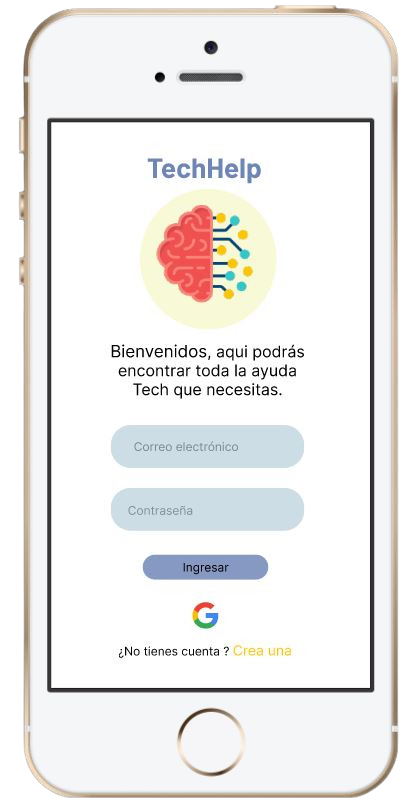
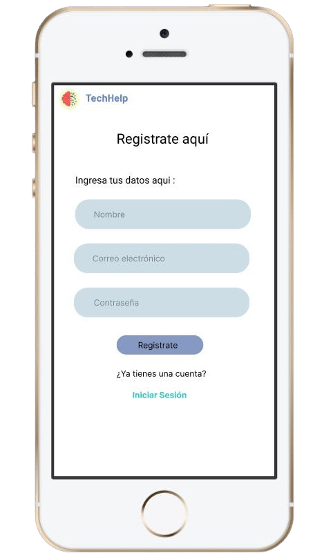
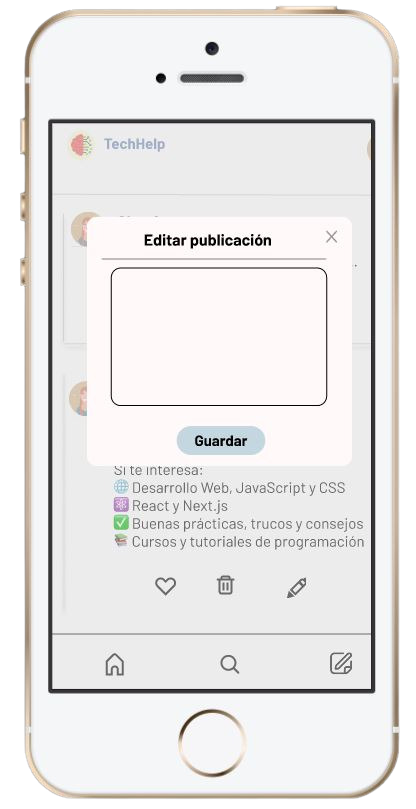
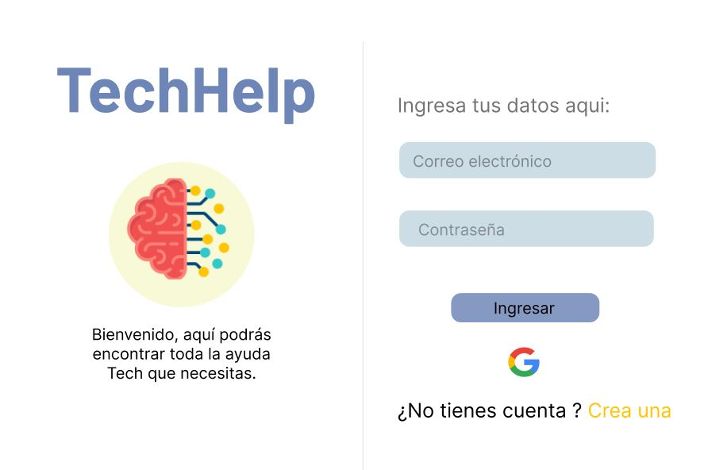

# TecHelp: Red Social para ayuda Tech

## 1. Introducción ✒️
Las redes sociales ganan cada vez más seguidores, niños, jóvenes y adultos estan prendados de ellas, nos son muy útiles en el día a día para diversos propósitos, desde diversión hasta educación y pensando en esto último es que nace Help Tech, una red social que permitirá a sus usuarios poder compartir información como links importantes, experiencias y aportes en general que puedan ayudar a otros usuarios en este camino del aprendizaje tech.

## 2. Resumen del proyecto 📝
Este proyecto de  Red Social tendrá como finalidad construir un SPA (aplicación web contenida en un único archivo)que permita a cualquier usuario crear una cuenta de
acceso y loguearse con ella y tener acceso a un muro para poder crear, editar, borrar y _"likear"_ publicacciones.

## 3. Descripción del proyecto 📔
 * ¿Quiénes son los principales usuarios de Tech Help?
 Personas  que inician y/o se encuentran recorriendo el mundo de la informática y necesitan un espacio en donde compartir información, hacer preguntas, desahogarse, interactuar con personas que pasan por su misma situación, con el fin de poder brindarse ayuda mutua y formar un bonita comunidad.

  * ¿ Cual es la necesidad o problema que HelpTech busca solucionar?
  Tech Help busca solucionar las inquietudes de las personas que se inician en el mundo de la informática, dentro de una comunidad amigable donde podrán compartir recursos gratuitos o rutas de aprendizaje asi como despejar libremente sus dudas y experiencias en su proceso de aprendizaje y alimentarse de la información compartida de usuarios mas experimentados en el tema.

### 3.1. Proceso creativo del diseño ⛱️

* Vista mobile 📱 Se realizaron los prototipos en Figma.

 
 
 
 

* Vista Desktop 🖥️

 
 

### 3.2.  Historias de Usuario y Criterios de Aceptación
🧑‍💻 Historia 1: Como usuario
quiero poder registrarme con mi cuenta de correo para acceder a la red

 - El usuario solo podrá registrarse una vez
 - El usuario podrá registrarse ingresando nombre, correo, contraseña.
 - La contraseña debe contener al menos 6 caracteres

🧑‍💻 Historia 2: Como usuario
quiero logearme con mi cuenta registrada
para acceder a la red social

  🏷️Criterios de aceptación:
   -  El email de usuario debe ser de una cuenta válida(que ya se registró)
 
 🧑‍💻 Historia 3 : Como usuario
quiero poder ingresar con otras cuentas de correo
para acceder con mayor facilidad a la red social

  🏷️Criterios de aceptación:
  - El usuario podrá acceder a la red con su cuenta de Gmail

🧑‍💻 Historia 4 : Como usuario de la red social
quiero poder postear mis publicaciones
para brindar mis aportes a la red social

 🏷️Criterios de aceptación:
  - El usuario podrá postear una o varias publicaciones en el muro

🧑‍💻 Historia 5 :Como usuario de la red social
quiero poder postear y  eliminar mis posts
para actualizar mis post

 🏷️Criterios de aceptación:
  -  El usuario podrá postear publicaciones en el muro
  -  El usuario podrá eliminar solo sus posts

🧑‍💻 Historia 6 : Como usuario
quiero poder dar editar mis posts
para actualizar la información

   🏷️Criterios de aceptación:
   - El usuario solo podrá editar solo sus posts
 

🧑‍💻 Como usuario
quiero poder dar like a mis posts y a los de los demas
para interactuar con los post

  🏷️Criterios de aceptación:
  - El icono de like debe pintarse
  - Los likes deben aumentar o disminuir al dar click
  - Solo se podrá dar un like por usuario a cada post

### 3.3 Despliegue 📦
_El despliegue fue realizado a través de GitHub Project y puede acceder a nuestra página desde aquí: _

## 4. Consideraciones Generales 🚀
* La lógica del proyecto está implementada completamente en JavaScript (ES6+), HTML y CSS.
*  Se uso [Firebase](https://console.firebase.google.com/), plataforma en la nube para el login y publicaciones de nuestra aplicación.
*  Se uso la librería [Jest](https://jestjs.io/docs/getting-started) para escribir y ejecutar tests.
 ### 4.1 Herramientas 🛠️
 * La planificación se realizó en Projects de GitHub
 * El prototipo se desarrolló en [Figma]

 ## 5. Autoras 🖋️

 😉 **Stefani Peñaranda** - [StefaniPenaranda](https://github.com/StefaniPenaranda)

 😉 **Olga Acosta** - [olgaabx](https://github.com/olgaabx)

 😉 **Angélica López** - [nanukelguru](https://github.com/nanukelguru) 

 
## 6. Objetivos de aprendizaje 📄
### HTML

- [x] **Uso de HTML semántico**

### CSS

- [x] **Uso de selectores de CSS**

- [x] **Modelo de caja (box model): borde, margen, padding**

- [x] **Uso de flexbox en CSS**

- [x] **Uso de CSS Grid Layout**

### Web APIs

- [x] **Uso de selectores del DOM**

- [x] **Manejo de eventos del DOM (listeners, propagación, delegación)**

- [x] **Manipulación dinámica del DOM**

- [x] **Ruteado (History API, evento hashchange, window.location)**

### JavaScript

- [x] **Arrays (arreglos)**

- [x] **Objetos (key, value)**

- [x] **Diferenciar entre tipos de datos primitivos y no primitivos**

- [x] **Variables (declaración, asignación, ámbito)**

- [x] **Uso de condicionales (if-else, switch, operador ternario, lógica booleana)**

- [x] **Uso de bucles/ciclos (while, for, for..of)**

- [x] **Funciones (params, args, return)**

- [ ] **Pruebas unitarias (unit tests)**

- [ ] **Pruebas asíncronas**

- [x] **Uso de mocks y espías**

- [x] **Módulos de ECMAScript (ES Modules)**

- [x] **Uso de linter (ESLINT)**

- [ ] **Uso de identificadores descriptivos (Nomenclatura y Semántica)**

- [x] **Diferenciar entre expresiones (expressions) y sentencias (statements)**

- [x] **Callbacks**

- [x] **Promesas**

### Control de Versiones (Git y GitHub)

- [x] **Git: Instalación y configuración**

- [x] **Git: Control de versiones con git (init, clone, add, commit, status, push, pull, remote)**

- [x] **Git: Integración de cambios entre ramas (branch, checkout, fetch, merge, reset, rebase, tag)**

- [x] **GitHub: Creación de cuenta y repos, configuración de llaves SSH**

- [x] **GitHub: Despliegue con GitHub Pages**

- [x] **GitHub: Colaboración en Github (branches | forks | pull requests | code review | tags)**

- [x] **GitHub: Organización en Github (projects | issues | labels | milestones | releases)**

### UX (User eXperience)

- [x] **Diseñar la aplicación pensando en y entendiendo al usuario**

- [x] **Crear prototipos para obtener feedback e iterar**

- [x] **Aplicar los principios de diseño visual (contraste, alineación, jerarquía)**

- [x] **Planear y ejecutar tests de usabilidad**

### Firebase

- [x] **Firebase Auth**

- [x] **Firestore**

# Creando una Red Social

## Índice

* [1. Preámbulo](#1-preámbulo)
* [2. Resumen del proyecto](#2-resumen-del-proyecto)
* [3. Objetivos de aprendizaje](#3-objetivos-de-aprendizaje)
* [4. Consideraciones generales](#4-consideraciones-generales)
* [5. Criterios de aceptación mínimos del proyecto](#5-criterios-de-aceptación-mínimos-del-proyecto)
* [6. Hacker edition](#6-hacker-edition)
* [7. Entrega](#7-entrega)
* [8. Pistas, tips y lecturas complementarias](#8-pistas-tips-y-lecturas-complementarias)

## 1. Preámbulo

Instagram, Snapchat, Twitter, Facebook, Twitch, Linkedin, etc. Las redes
sociales han invadido nuestras vidas. Las amamos u odiamos, y muchos no podemos
vivir sin ellas.

Hay redes sociales de todo tipo y para todo tipo de intereses. Por ejemplo,
en una ronda de financiamiento con inversionistas, se presentó una red social
para químicos en la que los usuarios podían publicar artículos sobre sus
investigaciones, comentar en los artículos de sus colegas, y filtrar artículos
de acuerdo a determinadas etiquetas o su popularidad, lo más reciente, o lo
más comentado.

## 2. Resumen del proyecto

En este proyecto construirás una Red Social sobre lo que decidan tú y tu equipo.
Podría ser, por ejemplo, sobre alimentación saludable, feminismo, educación,
salud, energías renovables, amantes de las [Empanadas](https://es.wikipedia.org/wiki/Empanada)
o de los [Tacos de Canasta](https://es.wikipedia.org/wiki/Taco), de la
[Feijoada](https://es.wikipedia.org/wiki/Feijoada), o de lo que sea.

Tu Red Social tendrá que permitir a cualquier usuario crear una cuenta de
acceso y loguearse con ella; crear, editar, borrar y _"likear"_ publicacciones.

El objetivo principal de aprendizaje de este proyecto es construir una
[Single-page Application (SPA)](https://es.wikipedia.org/wiki/Single-page_application)
[_responsive_](https://curriculum.laboratoria.la/es/topics/css/02-responsive) (con más de una vista / página)
en la que podamos **leer y escribir datos**.

## 3. Objetivos de aprendizaje

Reflexiona y luego marca los objetivos que has llegado a entender y aplicar en tu proyecto. Piensa en eso al decidir tu estrategia de trabajo.

### HTML

- [ ] **Uso de HTML semántico**

  

Links

  * [HTML semántico](https://curriculum.laboratoria.la/es/topics/html/02-html5/02-semantic-html)
  * [Semantics - MDN Web Docs Glossary](https://developer.mozilla.org/en-US/docs/Glossary/Semantics#Semantics_in_HTML)

### CSS

- [ ] **Uso de selectores de CSS**

  

Links

  * [Intro a CSS](https://curriculum.laboratoria.la/es/topics/css/01-css/01-intro-css)
  * [CSS Selectors - MDN](https://developer.mozilla.org/es/docs/Web/CSS/CSS_Selectors)

- [ ] **Modelo de caja (box model): borde, margen, padding**

  

Links

  * [Box Model & Display](https://curriculum.laboratoria.la/es/topics/css/01-css/02-boxmodel-and-display)
  * [The box model - MDN](https://developer.mozilla.org/en-US/docs/Learn/CSS/Building_blocks/The_box_model)
  * [Introduction to the CSS box model - MDN](https://developer.mozilla.org/en-US/docs/Web/CSS/CSS_Box_Model/Introduction_to_the_CSS_box_model)
  * [CSS display - MDN](https://developer.mozilla.org/pt-BR/docs/Web/CSS/display)
  * [display - CSS Tricks](https://css-tricks.com/almanac/properties/d/display/)

- [ ] **Uso de flexbox en CSS**

  

Links

  * [A Complete Guide to Flexbox - CSS Tricks](https://css-tricks.com/snippets/css/a-guide-to-flexbox/)
  * [Flexbox Froggy](https://flexboxfroggy.com/#es)
  * [Flexbox - MDN](https://developer.mozilla.org/en-US/docs/Learn/CSS/CSS_layout/Flexbox)

- [ ] **Uso de CSS Grid Layout**

  

Links

  * [A Complete Guide to Grid - CSS Tricks](https://css-tricks.com/snippets/css/complete-guide-grid/)
  * [Grids - MDN](https://developer.mozilla.org/en-US/docs/Learn/CSS/CSS_layout/Grids)

### Web APIs

- [ ] **Uso de selectores del DOM**

  

Links

  * [Manipulación del DOM](https://curriculum.laboratoria.la/es/topics/browser/02-dom/03-1-dom-methods-selection)
  * [Introducción al DOM - MDN](https://developer.mozilla.org/es/docs/Web/API/Document_Object_Model/Introduction)
  * [Localizando elementos DOM usando selectores - MDN](https://developer.mozilla.org/es/docs/Web/API/Document_object_model/Locating_DOM_elements_using_selectors)

- [ ] **Manejo de eventos del DOM (listeners, propagación, delegación)**

  

Links

  * [Introducción a eventos - MDN](https://developer.mozilla.org/es/docs/Learn/JavaScript/Building_blocks/Events)
  * [EventTarget.addEventListener() - MDN](https://developer.mozilla.org/es/docs/Web/API/EventTarget/addEventListener)
  * [EventTarget.removeEventListener() - MDN](https://developer.mozilla.org/es/docs/Web/API/EventTarget/removeEventListener)
  * [El objeto Event](https://developer.mozilla.org/es/docs/Web/API/Event)

- [ ] **Manipulación dinámica del DOM**

  

Links

  * [Introducción al DOM](https://developer.mozilla.org/es/docs/Web/API/Document_Object_Model/Introduction)
  * [Node.appendChild() - MDN](https://developer.mozilla.org/es/docs/Web/API/Node/appendChild)
  * [Document.createElement() - MDN](https://developer.mozilla.org/es/docs/Web/API/Document/createElement)
  * [Document.createTextNode()](https://developer.mozilla.org/es/docs/Web/API/Document/createTextNode)
  * [Element.innerHTML - MDN](https://developer.mozilla.org/es/docs/Web/API/Element/innerHTML)
  * [Node.textContent - MDN](https://developer.mozilla.org/es/docs/Web/API/Node/textContent)

- [ ] **Ruteado (History API, evento hashchange, window.location)**

  

Links

  * [Manipulando el historial del navegador - MDN](https://developer.mozilla.org/es/docs/DOM/Manipulando_el_historial_del_navegador)

### JavaScript

- [ ] **Arrays (arreglos)**

  

Links

  * [Arreglos](https://curriculum.laboratoria.la/es/topics/javascript/04-arrays)
  * [Array - MDN](https://developer.mozilla.org/es/docs/Web/JavaScript/Reference/Global_Objects/Array/)
  * [Array.prototype.sort() - MDN](https://developer.mozilla.org/es/docs/Web/JavaScript/Reference/Global_Objects/Array/sort)
  * [Array.prototype.forEach() - MDN](https://developer.mozilla.org/es/docs/Web/JavaScript/Reference/Global_Objects/Array/forEach)
  * [Array.prototype.map() - MDN](https://developer.mozilla.org/es/docs/Web/JavaScript/Reference/Global_Objects/Array/map)
  * [Array.prototype.filter() - MDN](https://developer.mozilla.org/es/docs/Web/JavaScript/Reference/Global_Objects/Array/filter)
  * [Array.prototype.reduce() - MDN](https://developer.mozilla.org/es/docs/Web/JavaScript/Reference/Global_Objects/Array/Reduce)

- [ ] **Objetos (key, value)**

  

Links

  * [Objetos en JavaScript](https://curriculum.laboratoria.la/es/topics/javascript/05-objects/01-objects)

- [ ] **Diferenciar entre tipos de datos primitivos y no primitivos**

- [ ] **Variables (declaración, asignación, ámbito)**

  

Links

  * [Valores, tipos de datos y operadores](https://curriculum.laboratoria.la/es/topics/javascript/01-basics/01-values-variables-and-types)
  * [Variables](https://curriculum.laboratoria.la/es/topics/javascript/01-basics/02-variables)

- [ ] **Uso de condicionales (if-else, switch, operador ternario, lógica booleana)**

  

Links

  * [Estructuras condicionales y repetitivas](https://curriculum.laboratoria.la/es/topics/javascript/02-flow-control/01-conditionals-and-loops)
  * [Tomando decisiones en tu código — condicionales - MDN](https://developer.mozilla.org/es/docs/Learn/JavaScript/Building_blocks/conditionals)

- [ ] **Uso de bucles/ciclos (while, for, for..of)**

  

Links

  * [Bucles (Loops)](https://curriculum.laboratoria.la/es/topics/javascript/02-flow-control/02-loops)
  * [Bucles e iteración - MDN](https://developer.mozilla.org/es/docs/Web/JavaScript/Guide/Loops_and_iteration)

- [ ] **Funciones (params, args, return)**

  

Links

  * [Funciones (control de flujo)](https://curriculum.laboratoria.la/es/topics/javascript/02-flow-control/03-functions)
  * [Funciones clásicas](https://curriculum.laboratoria.la/es/topics/javascript/03-functions/01-classic)
  * [Arrow Functions](https://curriculum.laboratoria.la/es/topics/javascript/03-functions/02-arrow)
  * [Funciones — bloques de código reutilizables - MDN](https://developer.mozilla.org/es/docs/Learn/JavaScript/Building_blocks/Functions)

- [ ] **Pruebas unitarias (unit tests)**

  

Links

  * [Empezando con Jest - Documentación oficial](https://jestjs.io/docs/es-ES/getting-started)

- [ ] **Pruebas asíncronas**

  

Links

  * [Tests de código asincrónico con Jest - Documentación oficial](https://jestjs.io/docs/es-ES/asynchronous)

- [ ] **Uso de mocks y espías**

  

Links

  * [Manual Mocks con Jest - Documentación oficial](https://jestjs.io/docs/es-ES/manual-mocks)

- [ ] **Módulos de ECMAScript (ES Modules)**

  

Links

  * [import - MDN](https://developer.mozilla.org/es/docs/Web/JavaScript/Reference/Statements/import)
  * [export - MDN](https://developer.mozilla.org/es/docs/Web/JavaScript/Reference/Statements/export)

- [ ] **Uso de linter (ESLINT)**

- [ ] **Uso de identificadores descriptivos (Nomenclatura y Semántica)**

- [ ] **Diferenciar entre expresiones (expressions) y sentencias (statements)**

- [ ] **Callbacks**

  

Links

  * [Función Callback - MDN](https://developer.mozilla.org/es/docs/Glossary/Callback_function)

- [ ] **Promesas**

  

Links

  * [Promise - MDN](https://developer.mozilla.org/es/docs/Web/JavaScript/Reference/Global_Objects/Promise)
  * [How to Write a JavaScript Promise - freecodecamp (en inglés)](https://www.freecodecamp.org/news/how-to-write-a-javascript-promise-4ed8d44292b8/)

### Control de Versiones (Git y GitHub)

- [ ] **Git: Instalación y configuración**

- [ ] **Git: Control de versiones con git (init, clone, add, commit, status, push, pull, remote)**

- [ ] **Git: Integración de cambios entre ramas (branch, checkout, fetch, merge, reset, rebase, tag)**

- [ ] **GitHub: Creación de cuenta y repos, configuración de llaves SSH**

- [ ] **GitHub: Despliegue con GitHub Pages**

  

Links

  * [Sitio oficial de GitHub Pages](https://pages.github.com/)

- [ ] **GitHub: Colaboración en Github (branches | forks | pull requests | code review | tags)**

- [ ] **GitHub: Organización en Github (projects | issues | labels | milestones | releases)**

### user-centricity

- [ ] **Diseñar un producto o servicio poniendo a la usuaria en el centro**

### product-design

- [ ] **Crear prototipos de alta fidelidad que incluyan interacciones**

- [ ] **Seguir los principios básicos de diseño visual**

### research

- [ ] **Planear y ejecutar testeos de usabilidad de prototipos en distintos niveles de fidelidad**

  

Links

  * [Intro a testeos usabilidad](https://coda.io/@bootcamp-laboratoria/contenido-ux/test-de-usabilidad-15)
  * [Pruebas con Usuarios 1 — ¿Qué, cuándo y para qué testeamos?](https://eugeniacasabona.medium.com/pruebas-con-usuarios-1-qu%C3%A9-cu%C3%A1ndo-y-para-qu%C3%A9-testeamos-7c3a89b4b5e7)

### Firebase

- [ ] **Firebase Auth**

  

Links

  * [Primeros pasos con Firebase Authentication en sitios web - Documentación oficial](https://firebase.google.com/docs/auth/web/start?hl=es)
  * [Administra usuarios en Firebase (onAuthStateChanged)](https://firebase.google.com/docs/auth/web/manage-users?hl=es#get_the_currently_signed-in_user)

- [ ] **Firestore**

  

Links

  * [Firestore - Documentación oficial](https://firebase.google.com/docs/firestore?hl=es)
  * [Reglas de seguridad de Firestore - Documentación oficial](https://firebase.google.com/docs/rules?hl=es)
  * [Obtén actualizaciones en tiempo real con Cloud Firestore - Documentación oficial](https://firebase.google.com/docs/firestore/query-data/listen?hl=es)

## 4. Consideraciones generales

* Este proyecto se debe trabajar en equipos de tres.

* La lógica del proyecto debe estar implementada completamente en JavaScript
  (ES6+), HTML y CSS :smiley:. Para este proyecto **no está permitido** utilizar
  _frameworks_ o librerías de CSS y JS.

* La división y organización del trabajo debe permitir, sin excepciones, que
  **cada integrante** del equipo practique el aprendizaje de todo lo involucrado
  en **cada historia**. _No se dividan el trabajo como en una fábrica._
  - ¿Hasta acá has avanzado en tus proyectos con cierta fluidez y sin mayores
    problemas? Sé generosa con tus compañeras, permíteles aprender y practicar
    sin restricciones, aunque tome un poco más de tiempo. Aproveha de
    _coachearlas_, de hacer _pair programming_, una de las mejores maneras de
    aprender es explicando verbalmente.

  - ¿Se te está haciendo difícil y te cuesta un poco más avanzar? No te quedes
    con las partes "fáciles" del proyecto, conversa, negocia, exige tu oportunidad
    para practicar y aprender lo que se te hace más difícil.

* Solamente pueden trabajar en una única historia por vez, no pueden avanzar a
  la siguiente sin haber completado la anterior. La historia se completa cuando
  se cumplen **todos** sus Criterios de Aceptación + **toda** su Definición
  de Terminado.

Para comenzar tendrás que hacer un _fork_ y _clonar_ este repositorio.

## 5. Criterios de aceptación mínimos del proyecto

### 5.1 Boilerplate

Este proyecto no incluye un _boilerplate_, así es que tendrás que definir la
estructura de carpetas y escribir tus propias Pruebas Unitarias (_tests_). Para
hacerlo, puedes guiarte de los proyectos anteriores.

### 5.2 Definición del producto

En el `README.md` cuéntanos brevemente cómo descubriste las necesidades de los
usuarios y cómo llegaste a la definición final de tu producto. Es importante
que detalles:

* Quiénes son los principales usuarios de producto.
* Qué problema resuelve el producto / para qué le servirá a estos usuarios.

### 5.3 Historias de usuario

Una vez que entiendas las necesidades de tus usuarixs, escribe las Historias de
Usuario que representen todo lo que necesitan hacer/ver en la Red Social. Cada
una de tus Historias de Usuario debe tener:

* **Criterios de Aceptación:** todo lo que debe ocurrir para satisfacer las
  necesidades del usuario.

* **Definición de terminado:** todos los aspectos técnicos que deben cumplirse
  para que, como equipo, sepan que esa historia está terminada y lista
  para publicarse. **Todas** tus Historias de Usuario (salvo excepciones), deben
  incluir estos aspectos en su Definición de Terminado (más todo lo que
  necesiten agregar):

  - Debe ser una SPA.
  - Debe ser _responsive_.
  - Deben haber recibido _code review_ de al menos una compañera de otro equipo.
  - Hicieron los _test_ unitarios
  - Testearon manualmente buscando errores e imperfecciones simples.
  - Hicieron _pruebas_ de usabilidad e incorporaron el _feedback_ de los
    usuarios como mejoras.
  - Desplegaron su aplicación y etiquetaron la versión (git tag).

### 5.4 Diseño de la Interfaz de Usuario (prototipo de baja fidelidad)

Debes definir cuál será el flujo que seguirá el usuario dentro de tu aplicación
y, con eso, diseña la Interfaz de Usuario (UI por sus siglas en inglés) que
siga este flujo.

### 5.5 Responsive

Debe verse bien en dispositivos de pantallas grandes
(computadoras/es, laptops, etc.) y pequeñas (_tablets_, celulares, etc.). Te
sugerimos seguir la técnica de _`mobile first`_ (más detalles sobre esta técnica
al final).

### 5.6 Consideraciones del comportamiento de la interfaz de usuario (UI)

Estas consideraciones te ayudarán a escribir las Definiciones de Terminado de
tus H.U.:

#### Creación de cuenta de usuario e inicio de sesión

* _Login_ con Firebase:
  - Para el _login_ y las publicaciones en el muro puedes utilizar [Firebase](https://firebase.google.com/products/database/)
  - Creación de cuenta de acceso y autenticación con cuenta de correo y
    contraseña, y también con una cuenta de Google.
* Validaciones:
  - Solamente se permite el acceso a usuarios con cuentas válidas.
  - No pueden haber usuarios repetidos.
  - La cuenta de usuario debe ser un correo electrónico válido.
  - Lo que se escriba en el campo (_input_) de contraseña debe ser secreto.
* Comportamiento:
  - Al enviarse el formulario de registro o inicio de sesión, debe validarse.
  - Si hay errores, se deben mostrar mensajes descriptivos para ayudar al
  usuario a corregirlos.

#### Muro/timeline

* Validaciones:
  - Al publicar, se debe validar que exista contenido en el _input_.
* Comportamiento:
  - Al recargar la aplicación, se debe verificar si el usuario está _logueado_
    antes de mostrar contenido.
  - Poder publicar un _post_.
  - Poder dar y quitar _like_ a una publicación. Máximo uno por usuario.
  - Llevar un conteo de los _likes_.
  - Poder eliminar un post específico.
  - Pedir confirmación antes de eliminar un _post_.
  - Al dar _click_ para editar un _post_, debe cambiar el texto por un _input_
    que permita editar el texto y luego guardar los cambios.
  - Al guardar los cambios debe cambiar de vuelta a un texto normal pero con la
    información editada.
  - Al recargar la página debo de poder ver los textos editados.

### 5.7 Consideraciones técnicas Front-end

* Separar la manipulación del DOM de la lógica (Separación de responsabilidades).
* Contar con múltiples vistas. Para esto, tu aplicación debe ser una
 [Single Page Application (SPA)](https://es.wikipedia.org/wiki/Single-page_application)
* Alterar y persistir datos. Los datos que agregues o modifiques deberán
  persistir a lo largo de la aplicación. Te recomendamos que uses
  [Firebase](https://firebase.google.com/) para eso también.

#### Pruebas unitarias (unit tests)

* Recuerda que no hay un _setup_ de **tests** definido, dependerá de
  la estructura de tu proyecto. Algo que no debes de olvidar es pensar en éstas
  pruebas, te pueden ayudar a definir la estructura y nomenclatura de tu lógica.

* Los tests unitarios deben cubrir un mínimo del 70% de _statements_, _functions_,
  _lines_, y _branches_.

### 5.8 Consideraciones técnicas UX

* Hacer al menos 2 entrevistas con usuarios.
* Hacer un  prototipo de baja fidelidad.
* Asegurarte de que la implementación en código siga los lineamientos del
  diseño.
* Hacer sesiones de _testing de usabilidad_ con el producto en HTML.

## 6. Hacker edition

Las secciones llamadas _Hacker Edition_ son **opcionales**. Si **terminaste**
con todo lo anterior y te queda tiempo, intenta completarlas. Así podrás
profundizar y/o ejercitar más sobre los objetivos de aprendizaje del proyecto.

* Permite crear posts con imágenes.
* Permite buscar usuarios, agregar y eliminar "amigos".
* Permite definir la privacidad de los _posts_ (público o solamente para amigos).
* Permite ver su muro de cualquier usuario "no-amigo" (solamente los
  posts _públicos_).
* Permite comentar o responder una publicación.
* Permite editar perfil.

## 7. Entrega

El proyecto será _entregado_ subiendo tu código a GitHub (`commit`/`push`) y la
interfaz será desplegada usando GitHub pages u otro servicio de hosting que
puedas haber encontrado en el camino.

***

## 8. Pistas, tips y Lecturas complementarias

### Mobile first

El concepto de [_mobile first_](https://www.mediaclick.es/blog/diseno-web-responsive-design-y-la-importancia-del-mobile-first/)
hace referencia a un proceso de diseño y desarrollo donde partimos de cómo se ve
y cómo funciona la aplicación en un dispositivo móvil primero, y más adelante se
ve como adaptar la aplicación a pantallas progresivamente grandes y
características específicas del entorno desktop. Esto es en contraposición al
modelo tradicional, donde primero se diseñaban los websites (o webapps) para
desktop y después se trataba de _arrugar_ el diseño para que entre en pantallas
más chicas. La clave acá es asegurarse de que desde el principio diseñan usando
la vista _responsive_ de las herramientas de desarrollador (developer tools) del
navegador. De esa forma, partimos de cómo se ve y comporta la aplicación en una
pantalla y entorno móvil.

### Múltiples vistas

En proyectos anteriores nuestras aplicaciones habían estado compuestas de una
sola _vista_ principal (una sóla _página_). En este proyecto se introduce la
necesidad de tener que dividir nuestra interfaz en varias _vistas_ o _páginas_
y ofrecer una manera de navegar entre estas vistas. Este problema se puede
afrontar de muchas maneras: con archivos HTML independientes (cada uno con su
URL) y links tradicionales, manteniendo estado en memoria y rederizando
condicionalmente (sin refrescar la página), [manipulando el historial del
navegador](https://developer.mozilla.org/es/docs/DOM/Manipulando_el_historial_del_navegador)
con [`window.history`](https://developer.mozilla.org/es/docs/Web/API/Window/history).
En este proyecto te invitamos a explorar opciones y decidir una opción
de implementación.

### Escritura de datos

En los proyectos anteriores hemos consumido (leído) datos, pero todavía no
habíamos escrito datos (salvar cambios, crear datos, borrar, ...). En este
proyecto tendrás que crear (salvar) nuevos datos, así como leer, actualizar y
modificar datos existentes. Estos datos se podrán guardar de forma remota
usando [Firebase](https://firebase.google.com/).

Otras:

* [Modulos: Export](https://developer.mozilla.org/es/docs/Web/JavaScript/Referencia/Sentencias/export)
* [Modulos: Import](https://developer.mozilla.org/es/docs/Web/JavaScript/Referencia/Sentencias/import)
* [Diseño web, responsive design y la importancia del mobile first - Media Click](https://www.mediaclick.es/blog/diseno-web-responsive-design-y-la-importancia-del-mobile-first/)
* [Mobile First: el enfoque actual del diseño web móvil - 1and1](https://www.1and1.es/digitalguide/paginas-web/diseno-web/mobile-first-la-nueva-tendencia-del-diseno-web/)
* [Mobile First - desarrolloweb.com](https://desarrolloweb.com/articulos/mobile-first-responsive.html)
* [Mobile First Is NOT Mobile Only - Nielsen Norman Group](https://www.nngroup.com/articles/mobile-first-not-mobile-only/)
